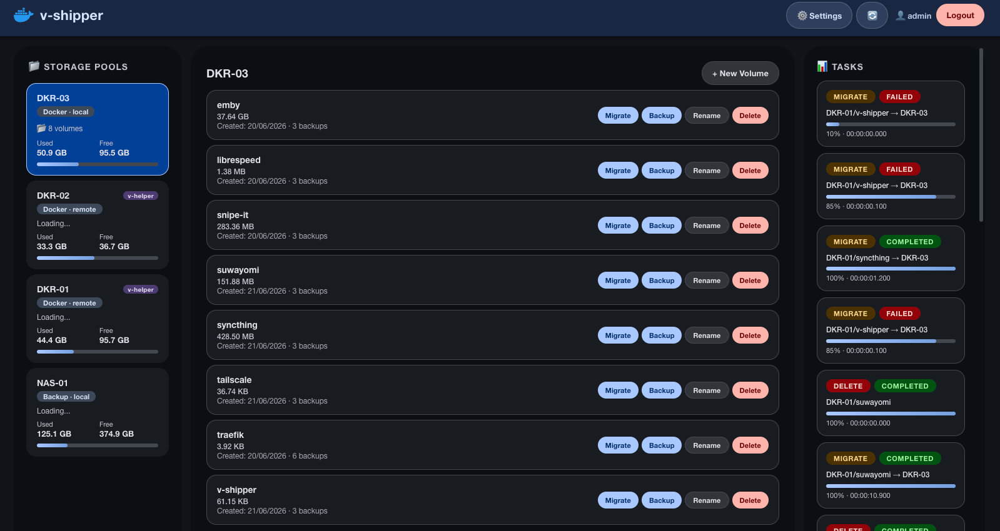

# v-shipper

Docker volume migration and backup tool with a web UI. Stateless, containerized, Alpine-based.

<p align="center">  </p>

## Features

- **Web UI** — responsive dashboard with login, pool browser, and task history
- **Pool Management** — local pools and remote rsync daemon pools
- **Volume Migration** — rsync-based with permission preservation and optional verify + delete-source; remote→remote supported via a destination v-helper pull
- **Volume Permissions** — view and change a volume's owner, group, and octal mode (`chmod -R` / `chown -R`) from the UI, on local and remote (v-helper) pools
- **Container Awareness** — optional Docker socket integration shows which containers use each volume (with running/stopped status) and warns before migrating, renaming, or deleting a volume that's in use
- **Backup / Restore** — tar.gz archives to local or remote rsync backup pools
- **Backup Schedules** — cron-based scheduled backups with configurable retention
- **Telegram Notifications** — per-topic alerts for backup, migration, restore, and other events
- **v-helper Integration** — remote pools backed by [v-helper](https://github.com/ZeroOmar/v-helper) gain create/rename volume support and real disk free space
- **Exclusive Locks** — prevents concurrent operations on the same volume
- **Real-time Progress** — polling-based task progress with background size calculation
- **Crash Recovery** — persists task state; marks incomplete tasks failed on restart
- **Containerized** — Alpine Linux, multi-platform (amd64 + arm64)

## Configuration

All configuration is in a single `VOLUME_MANAGER_CONFIG` environment variable (multiline YAML):

```yaml
docker_hosts:
  - name: local-pool
    pool: /var/lib/docker/volumes
    pool_type: local
    # Optional: report which containers use each volume (requires the Docker
    # socket mounted into the v-shipper container).
    docker_socket: true
    # Optional: host path the volumes really live at, when it differs from the
    # path v-shipper sees (e.g. a remapped bind mount). Used to match container
    # mounts to volumes. Defaults to `pool` (identity).
    docker_host_path: /var/docker-volumes
    # Optional: grace period (seconds) given to a container to shut down cleanly
    # when an operation stops it, before Docker sends SIGKILL. Defaults to 120.
    container_stop_timeout: 120

  - name: remote-nas
    pool: /            # placeholder; ignored for remote pools
    pool_type: remote
    remote_host: 10.0.0.5:873
    rsync_module: docker-volumes
    # Optional: connect to a v-helper sidecar for create/rename/disk-free support
    api_host: 10.0.0.5:8888
    api_key: your-shared-secret

backup_pools:
  - name: local-backup
    pool: /mnt/backups
    pool_type: local

  - name: remote-backup
    pool: /            # placeholder; ignored for remote pools
    pool_type: remote
    remote_host: 10.0.0.5:873
    rsync_module: docker-backup

tmp_dir: /tmp               # base dir for locks and staging (default: /tmp)
staging_dir: /tmp/staging   # override staging path (default: {tmp_dir}/staging)
config_dir: /config         # persistent config dir for task/schedule/notification state (default: /config)

web_ui:
  port: 8000
  admin_user: admin
  admin_password: YWRtaW4=  # base64("admin") — use a strong password in production
```

### Pool types

| `pool_type` | How it works |
|---|---|
| `local` | Direct filesystem access. `pool` is the absolute path. |
| `remote` | rsync daemon protocol. Requires `remote_host` (`host:port`) and `rsync_module`. `pool` is ignored. |
| `remote` + v-helper | Add `api_host` and `api_key` to connect a [v-helper](https://github.com/ZeroOmar/v-helper) sidecar. Enables create/rename volume, real disk free space, and **remote→remote migration** (see below). File transfers still use rsync. |

Remote pools must be accessible via the rsync daemon protocol (`rsync://host:port/module`). SSH is not supported. For NFS/CIFS-mounted paths, use `pool_type: local` with the mount path.

**Remote→remote migration** — native rsync cannot transfer daemon-to-daemon ("source and destination cannot both be remote"). When both pools are remote and the **destination** has a v-helper (`api_host`/`api_key`), v-shipper instructs that v-helper to pull directly from the source's rsync module and streams its progress and logs back into the task. This requires the destination host to reach the source's rsync daemon on port 873, and the source's rsync `hosts allow` to include the destination host. Without a v-helper on the destination, the migration falls back to direct rsync and reports the daemon-to-daemon error.

### Encoding the admin password

```bash
echo -n "yourpassword" | base64
```

## Quick start

### Local dev (Python)

```bash
python3 -m venv venv
source venv/bin/activate
pip install -r requirements.txt

# Edit run_dev.sh with your pool paths, then:
bash run_dev.sh
```

Open http://localhost:8000 — default credentials: `admin` / `admin`.

### Docker Compose

```bash
docker-compose up
# UI at http://localhost:8000
```

### Docker (production)

```bash
docker run -d \
  --name v-shipper \
  -p 80:80 \
  -e VOLUME_MANAGER_CONFIG="$(cat config.yaml)" \
  -e TZ=Europe/London \
  -v /var/lib/docker/volumes:/mnt/docker_volumes:ro \
  -v /mnt/backups:/mnt/backups:rw \
  ghcr.io/zeroomar/v-shipper:latest
```

Set `TZ` to your local IANA timezone (e.g. `Europe/London`, `America/New_York`) so
backup schedules fire at the wall-clock times you enter. If unset, the scheduler
falls back to the host's local zone, then UTC.

## API

All endpoints require authentication (session cookie set at login).

### Auth
| Method | Path | Description |
|---|---|---|
| POST | `/api/login` | Login — returns session cookie |
| POST | `/api/logout` | Logout |

### Pools & volumes
| Method | Path | Description |
|---|---|---|
| GET | `/api/pools` | List all pools with disk stats |
| GET | `/api/volumes?pool=<name>` | List volumes in a pool |
| GET | `/api/volume/<pool>/<name>` | Volume detail |
| POST | `/api/volume/create` | Create a new volume directory |
| POST | `/api/rename` | Rename volume |
| POST | `/api/delete` | Delete volume (warns if no backup exists) |
| POST | `/api/pool/create` | Create new local pool directory |

### Operations
| Method | Path | Description |
|---|---|---|
| POST | `/api/migrate` | Start rsync migration |
| POST | `/api/backup` | Start backup to archive |
| POST | `/api/restore` | Restore from archive |

### Tasks
| Method | Path | Description |
|---|---|---|
| GET | `/api/task/<id>/progress` | Poll task progress |
| GET | `/api/task/<id>/logs` | Captured log lines for a task |
| GET | `/api/tasks` | Task history |

### Backup schedules
| Method | Path | Description |
|---|---|---|
| GET | `/api/schedules` | List all backup schedule jobs |
| POST | `/api/schedules` | Create a new schedule job |
| PUT | `/api/schedules/{id}` | Update a schedule job |
| DELETE | `/api/schedules/{id}` | Delete a schedule job |
| POST | `/api/schedules/{id}/toggle` | Enable or disable a schedule job |
| POST | `/api/schedules/{id}/run` | Trigger a schedule job immediately |

### Notifications
| Method | Path | Description |
|---|---|---|
| GET | `/api/notifications` | List all notification configs |
| POST | `/api/notifications` | Create a notification config |
| PUT | `/api/notifications/{id}` | Update a notification config |
| DELETE | `/api/notifications/{id}` | Delete a notification config |
| POST | `/api/notifications/{id}/toggle` | Enable or disable a notification config |
| POST | `/api/notifications/{id}/test` | Send a test notification |

### Utility
| Method | Path | Description |
|---|---|---|
| GET | `/api/health` | Health check |
| GET | `/api/refresh` | Force a volume size cache refresh |
| POST | `/api/debug/cleanup` | Clear stale lock files and task state |

### Example — migrate via curl

```bash
# Login (saves session cookie)
curl -X POST http://localhost/api/login \
  -H "Content-Type: application/json" \
  -d '{"username":"admin","password":"admin"}' \
  -c cookies.txt

# List pools
curl -b cookies.txt http://localhost/api/pools

# Start migration
curl -X POST http://localhost/api/migrate \
  -H "Content-Type: application/json" \
  -b cookies.txt \
  -d '{"source_pool":"local-pool","source_volume":"myvolume","dest_pool":"remote-nas","verify":true,"delete_source":false}'

# Poll until done
curl -b cookies.txt http://localhost/api/task/<task_id>/progress
```

## Project structure

```
v-shipper/
├── app/
│   ├── app.py              # FastAPI entry point, lifespan, CORS
│   ├── config.py           # YAML config load, auth validation
│   ├── models.py           # Pydantic request/response models
│   ├── validation.py       # Shared input validators, safe_join
│   ├── api/
│   │   └── routes.py       # All REST endpoints
│   └── services/
│       ├── volume_service.py      # Volume discovery, stats, rename/delete
│       ├── migration_service.py   # rsync orchestration, lockfiles
│       ├── backup_service.py      # tar archiving, remote restore staging
│       ├── scheduler_service.py   # APScheduler-backed cron backup jobs
│       ├── notification_service.py # Telegram notification delivery
│       ├── remote_api_client.py   # HTTP client for v-helper control API
│       ├── docker_service.py      # Docker SDK wrapper (minimal use)
│       └── task_queue.py          # Sequential queue, progress, crash recovery
├── app/templates/index.html       # SPA shell
├── app/static/
│   ├── main.js             # All client-side logic
│   └── style.css
├── Dockerfile
├── docker-compose.yml
├── requirements.txt
├── run_dev.sh              # Dev server launcher (restricts reload to app/)
└── .github/workflows/
    └── docker-publish.yml  # Multi-platform build → GHCR
```

## Troubleshooting

**Login fails** — decode and verify the config password:
```bash
echo "YWRtaW4=" | base64 -d   # should print: admin
```

**Remote pool shows unreachable** — test the rsync daemon directly:
```bash
rsync --list-only rsync://host:873/module/
```

**v-helper badge missing / create+rename not available on remote pool** — confirm `api_host` and `api_key` are set in the pool config and that the v-helper container is reachable:
```bash
curl -H "X-API-Key: your-secret" http://host:8888/health
```

**Volumes not showing for remote docker host** — verify the rsync module exposes volume directories at the top level (not nested under a subdirectory).

**Task stuck pending / lock file stale** — use the 🧹 Cleanup button in the UI, or:
```bash
curl -X POST -b cookies.txt http://localhost/api/debug/cleanup
```

**Dev server restarts during operations** — always use `bash run_dev.sh` (limits file-watching to `app/`). Never run `uvicorn --reload` without `--reload-dir app` in dev.

## Releasing

Pushing a semver tag triggers GitHub Actions to (1) build and push the image and (2) publish a GitHub Release. Use an **annotated** tag — its message becomes the release notes (there is no CHANGELOG.md; each release carries its own notes):
```bash
git tag -a 0.12.0 -F notes.md   # notes.md = curated release notes
git push origin 0.12.0
# → ghcr.io/zeroomar/v-shipper:0.12.0
# → https://github.com/ZeroOmar/v-shipper/releases/tag/0.12.0
```

## Limitations

- One operation at a time (sequential task queue by design)
- Single admin account (no RBAC)
- In-memory session store (cleared on restart)
- Per-task log buffer is in-memory only — logs are lost on server restart
